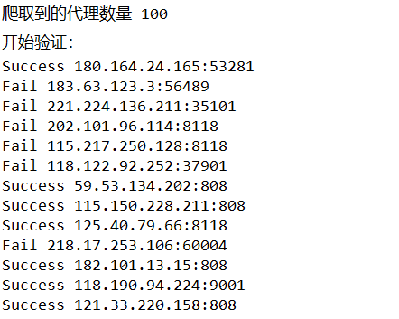
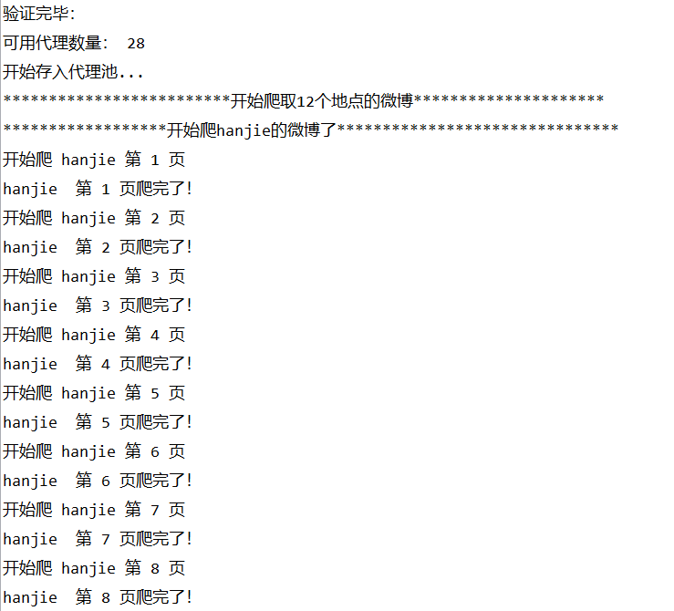
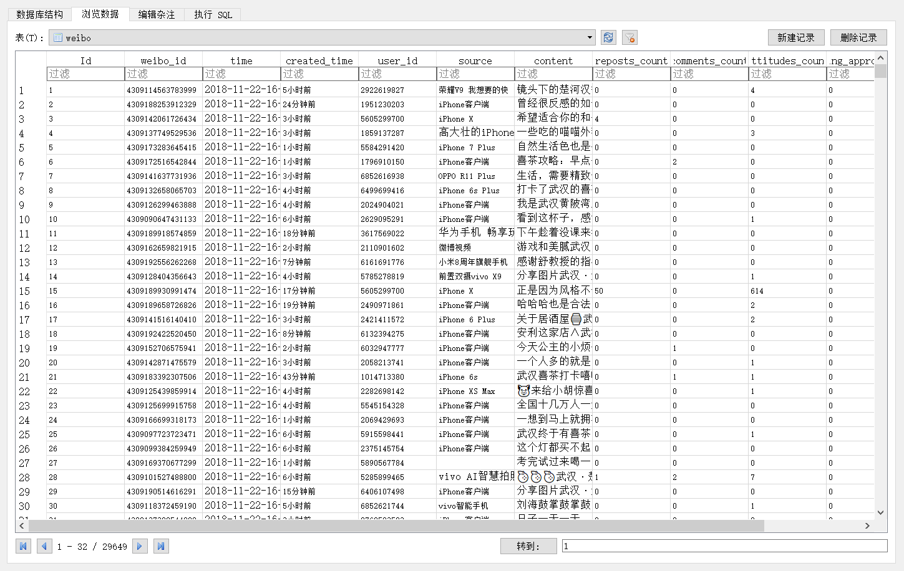
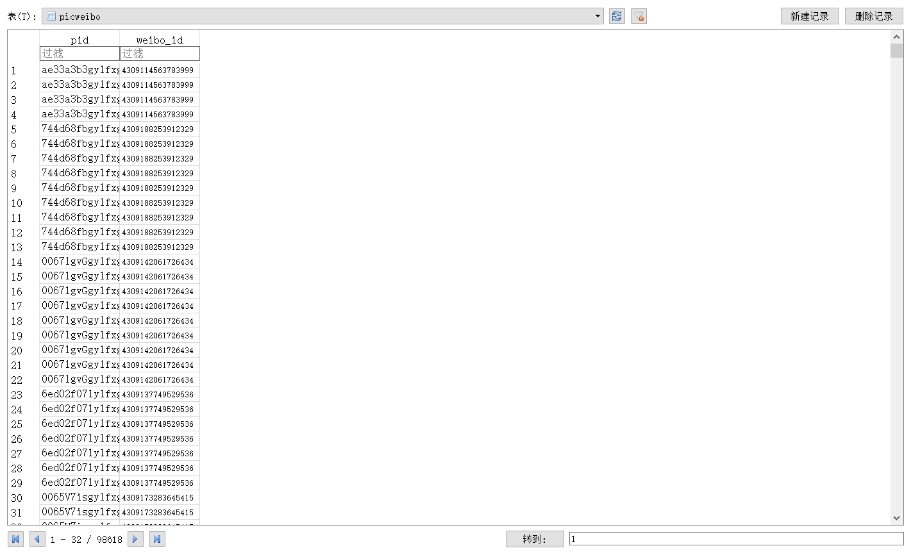

# 微博签到页爬虫

项目链接：https://github.com/RealIvyWong/WeiboCrawler/tree/master/WeiboLocationCrawler

## 1 实现功能

这个项目是用来爬取微博签到页的微博数据（每三个小时爬一次），并写进 sqlite 数据库。

关于**微博签到页**打个比方，就是类似这个https://weibo.com/p/100101B2094757D069A7FE449F


顺便一说，这个页面是不用微博登录就可以访问的。所以方便很多啊（不用模拟登录）。

## 2 依赖环境

使用的是Python 3.7（在云上用过3.5也完全ok）。

需要额外的第三方库有yagmail（用来发送邮件）,pandas，bs4。均可使用pip来安装。

```
pip install yagmail pandas bs4
```

## 3 使用方法

**step1.** 修改pid.csv中的地点名词与对应的id。

**step2.** 修改start.py中的邮箱账号密码。

**step3.** Run start.py。

## 4 文件说明

包含四个文件。

### pid.csv

是放置地点的名称和微博页面对应的位置 id。比如说上面的珞珈山，就是网页 URL 最后的那一串数字**100101B2094757D069A7FE449F**。

### buildip.py

是在网上看到别人写的……具体忘了哪的，如果本尊看到！sorry！请联系我注明！

我稍微修改了下。这个文件是一个实现爬取代理网站上的代理 IP 来构建代理池的模块。

### crawler.py

爬虫本体。

### start.py

控制爬取多个地点的一个启动文件。

## 5 爬取示例

如果开始成功运行之后，控制台输出大概是这样的。先获取代理 ip（这可能需要 10 分钟左右？）。



然后获取完代理就一个一个地点开始爬，像这样。



这个页数是由那个签到点的微博数定的，如果很冷门，可能就十几页甚至几页。当然，最多新浪只会让我们爬 150 页，所以不是这个签到点的所有数据都能爬到。

得到的`weibo.sqlite`结构是包含三个表，`weibo`表（用来存储微博具体的信息）、`pic`表（用来存储微博图片的 url，因为一条微博可能有多张图）和`picweibo`表（建立 pic 的 id 和 weibo 的 id 的联系的表）。






## 6 Contact Me

如果有什么建议或意见，欢迎联系我（huangyingjing@whu.edu.cn)或者提 issue！
