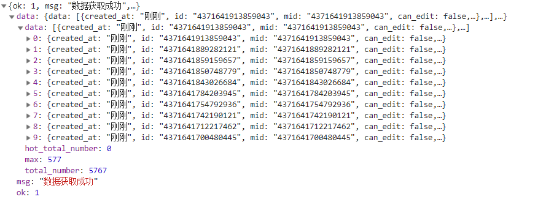

# 单条微博转发或评论爬虫 之 爬取方法

## 目标网页

爬虫是针对网页进行爬取，所以我们要知道需要爬的目标网页。

直接爬 weibo.com 肯定是不行的，电脑端的反爬还是挺麻烦的。然后看了其他人的爬虫，get 了以下两个网址。

**转发爬取**`https://m.weibo.cn/api/statuses/repostTimeline?id={}&page={}`

**评论爬取**`https://m.weibo.cn/api/comments/show?id={}&page={}`

其中 id 这个参数指的就是微博的二进制 id 或者数字 id，page就是翻页很好理解。

获取的是 json 数据。结构如下图所示。其中的0-9就是每条转发或者评论的详细信息。



但是这两个网页基本上都只能爬个 100 页左右，所以最多爬可能大概 1000 条左右就返回的 ok 值为 0 了。

但是的但是也不是很稳定的样子？我看其他人使用这个评论爬取页面都没加 cookie，但是我自己使用的使用到第 3 页的时候不加 cookie 就会跳转登录页面，不管是浏览器还是爬虫。然后，转发爬取页面刚刚跑了下，竟然爬到了120+页？

所以**应对策略**就是写一个 while True 死循环嘛，page 一直加上去，直到返回的 ok 值为 0 就好了。如果不加 cookie，无法访问跳转登录页面的话，状态码会是 404。所以再加一个判断语句，状态码是404的时候，我们才加我们的 cookie。能不用自己的账号信息就不用嘛。如果用了 cookie 的话，稳妥一点还是让程序等个 3 秒钟，假装是人为地刷微博，保护一下账号不要被封（或许可以再短一点，但是 3 秒这个间隔，我是可以接受的，所以就没有试其他的）。

所以这写了下面这个函数来获取网页回传的 json 数据。

```python
def getJson(mid,page,type,ippool):
    global cookie

    if type=='repost':
        url='https://m.weibo.cn/api/statuses/repostTimeline?id={}&page={}'.format(mid,page)
    else:
        url='https://m.weibo.cn/api/comments/show?id={}&page={}'.format(mid,page)
    headers = {
    'User-agent' : 'Mozilla/5.0 (Macintosh; Intel Mac OS X 10.12; rv:55.0) Gecko/20100101 Firefox/55.0',
    'Host' : 'm.weibo.cn',
    'Accept' : 'application/json, text/plain, */*',
    'Accept-Language' : 'zh-CN,zh;q=0.8,en-US;q=0.5,en;q=0.3',
    'Accept-Encoding' : 'gzip, deflate, br',
    'Referer' : 'https://m.weibo.cn/status/' + mid,
    'DNT' : '1',
    'Connection' : 'keep-alive',
    }

    proxy_ip=ippool[random.randint(0,len(ippool)-1)]
    while True:
        try:
            res=requests.get(url=url,headers=headers, proxies=proxy_ip,timeout=20)
            res.encoding='utf-8'
            if res.status_code==404:
                if 'cookie' in headers.keys():
                    cookie=input('cookie失效了，重新输入下：')
                headers['cookie']=cookie
                time.sleep(3)
                continue
            break
        except requests.exceptions.ProxyError as e:
            # 如果是代理不行的话
            print('代理不行，换代理')
            ippool.remove(proxy_ip)
            # 代理池没有存货了的话，那就再爬一遍代理
            if len(ippool)<1:
                ippool=ippool.buildippool()
            proxy_ip=ippool[random.randint(0,len(ippool)-1)]
        except Exception as e:
            # 其他错误的话，就打印看下，退出程序
            # 但是好像一般没有
            print(e)
            sys.exit()

    jd = json.loads(res.text)

    if jd['ok']==1:
        return jd,ippool
    else:
        print(jd) # 也可以不打印这个，但是有点怕是其他的报错情况让ok为0
        print('这里好像没内容了')
        return 0,ippool
```

## 其他

解析 json 写入数据库的代码就不解释了，基本上都是基础操作。

值得一提的是 buildippool.py 代码里使用的免费代理网页（https://raw.githubusercontent.com/fate0/proxylist/master/proxy.list）。忘记是哪里看到的了，大概有几千个？非常好用！！

由于一一验证可用性会非常耗费时间，所以我只是把爬取的内容进行了洗牌，挑出了前面的100个。

而我们要爬取的网页都是 https 的，所以 100 个中还过滤了 http 的代理，所以你们看到一般可能才爬到 40 , 50 个左右。然后验证可用性之后，可能只剩下 10 多个的样子。不要慌张！完全够用！

而且上面那个函数里，还有个机制就是，如果使用这个代理无法访问或者访问超时，会从当前代理池里剔除掉。如果代理池为空了，那就重新再爬一遍这个代理网站。

## Contact Me

如果有什么建议或意见，欢迎联系我（huangyingjing@whu.edu.cn)或者提issue！
