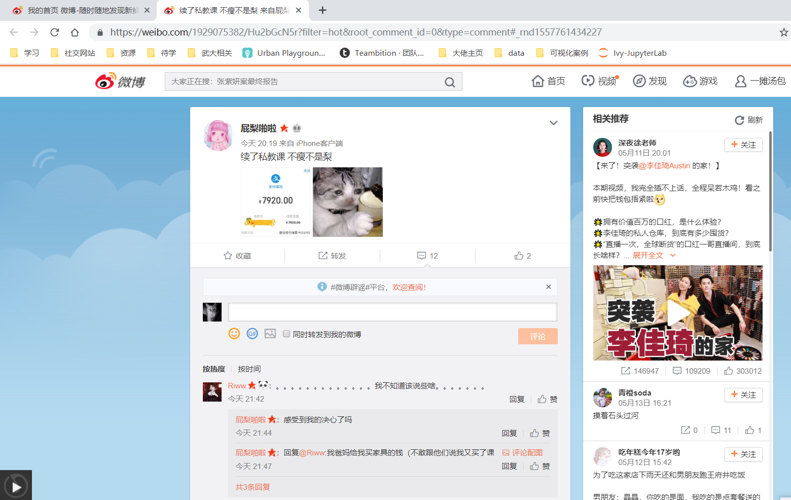
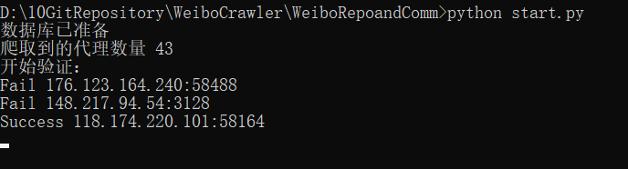
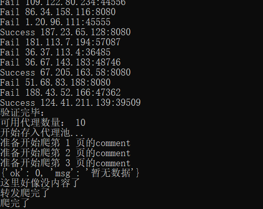
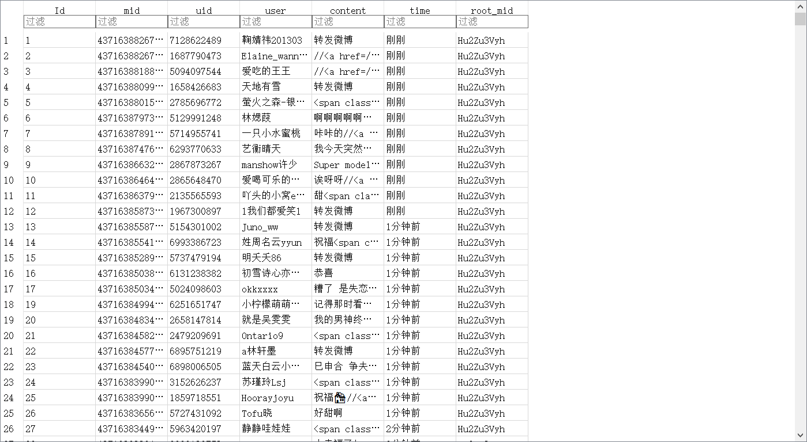
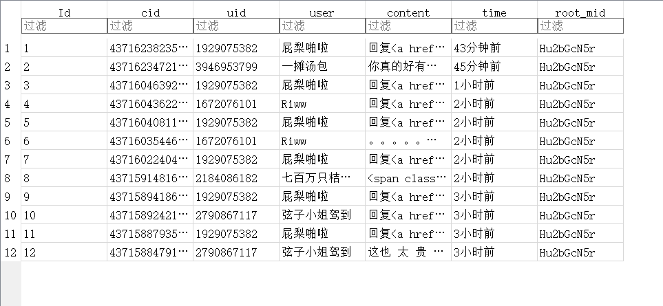

# 单条微博转发或评论爬虫

项目链接：https://github.com/RealIvyWong/WeiboCrawler/tree/master/WeiboLocationCrawler

## 1 实现功能

这个项目是用来爬取单条微博的转发或者评论博数据，并写进 sqlite 数据库。

可能会用到你自己的 cookie（代码中要求必须写，不然会报错）。

## 2 依赖环境

使用的是 Python 3.7。

无需额外的第三方库。

## 3 使用方法

**step1.** 修改 start.py 中的 cookie, mid（微博 id），type（转发 repost 还是评论 comment )。

**step2.** Run start.py。

如果使用了 cookie 访问网页的话，会比较慢一点，因为不想被封号……所以设置的3s访问一次。

> 【**解释一下什么是微博id**】
>
> 对于电脑端 weibo.com 来说，点击一条微博的评论处的查看更多，就会跳转这条微博的微博页。类似下图。
>
> 
>
> 而地址栏中的网址`<https://weibo.com/1929075382/Hu2bGcN5r?filter=hot&root_comment_id=0&type=comment#_rnd1557761434227>`中的`Hu2bGcN5r`就是这条微博的二进制 id 了。其实微博还有数字 id ，但是都一样，不用 care 这么多。

## 4 文件说明

包含三个文件。

### buildippool.py

这个文件是一个实现爬取代理网站上的代理 IP 来构建代理池的模块。

### crawler.py

爬虫本体。

### start.py

一个启动文件。

## 5 爬取示例

如果开始成功运行之后，控制台输出大概是这样的。先获取代理 ip（这可能需要 5 分钟左右？）。

然后获取完代理就一页一页的转发评论开始爬，限制是最多爬 100 页，所以最多可能只能爬个 1000 条的样子。运行时像下图这样，我爬的示例微博评论有点少，所以才两页。

得到的`weibo.sqlite`结构是包含一个表，如果爬的是转发，就是 repost 表；爬的是评论就是 comment 表。

——**repost 表**

表的字段有 id（序号）, mid（转发微博的 id）, uid（用户 id）, user（用户名）, content（转发内容）, time（转发时间）, root_mid（原微博 id)。

——**comment 表**

表的字段有 id（序号）, cid（评论 id）, uid（用户 id）, user（用户名）, content（评论内容）, time（评论时间）, root_mid（原微博 id)。

## 6 爬取细节

想要了解一下爬取的细节的话，看这个文件夹里的 **Method.md** 文件。大致讲了一下我的代码的思路。

## 7 Contact Me

如果有什么建议或意见，欢迎联系我（huangyingjing@whu.edu.cn)或者提 issue！
